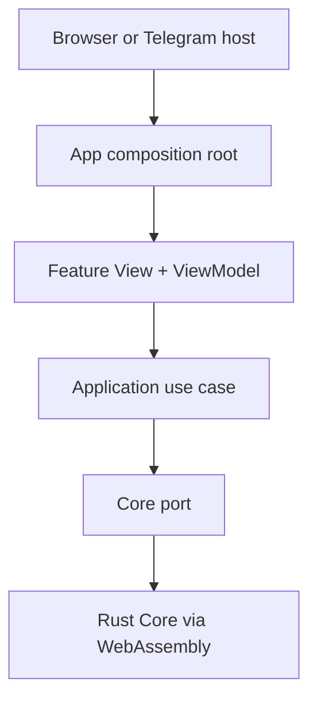

# Web Architecture

## Decision

0x1 Web uses **Clean Architecture across repository boundaries** and **MVVM inside presentation features**.

This is a composition, not two competing application architectures:

- Clean Architecture decides which layer may depend on which other layer;
- application use cases orchestrate ports without owning protocol rules;
- MVVM turns application projections into stable, testable view state;
- React views render that state and emit user intent;
- browser and messenger APIs enter only through host adapters;
- `nilx-one/core` remains the executable owner of shared protocol and product behavior.

VIPER is not the default for React features. Its Router and Presenter roles overlap with typed routing and MVVM view models, while its additional objects add little isolation at this stage. A feature may adopt a stricter interactor/presenter split later only when its complexity demonstrates the need.

## Dependency rule

Dependencies point inward:

| Scope         | May depend on                        | Must not own                                                                     |
| ------------- | ------------------------------------ | -------------------------------------------------------------------------------- |
| `application` | no Web package                       | BondChain completion, Relationship derivation, gamification, or other Core rules |
| `product-app` | `application`, `host-contract`, `ui` | host SDK access or protocol decisions                                            |
| `ui`          | React                                | use cases, Core bindings, host behavior, or product state                        |
| `core-wasm`   | `application` ports                  | presentation or host behavior                                                    |
| host adapters | `host-contract`                      | product flows or protocol authority                                              |
| `apps/*`      | composition dependencies             | copied screens or business logic                                                 |

The architecture test rejects forbidden internal imports and messenger-global access outside its adapter.

## Runtime composition



The arrow into WebAssembly is an adapter boundary. Until a versioned Core artifact exists, the adapter returns an explicit unavailable projection. The UI must not replace the missing behavior with TypeScript rules or sample relationship truth.

## Host boundary

Every host provides capabilities through `host-contract`:

- authentication envelope;
- theme and safe-area state;
- lifecycle events;
- back navigation;
- haptics;
- external links and sharing.

Telegram `initData` is always marked unverified at the client boundary. It becomes authentication context only after server-side signature validation. Host availability changes presentation capability, never Core semantics.

## Rendering boundary

Custom graphics select WebGPU by capability. Failure to acquire an adapter falls back to WebGL2. If neither is available, the feature exposes an unsupported state. There is no `CanvasRenderingContext2D` fallback.

MapLibre will own geographic rendering when the map vertical slice begins. Shared spatial and visibility decisions must arrive as Core projections rather than TypeScript rules.

## Feature shape

Each product feature grows vertically:

```text
features/<feature>/
├── <feature>-view.tsx
├── <feature>-view-model.ts
└── <feature>-view-model.test.ts
```

Use cases and ports that are shared across presentation features live in `application`. Host-specific branches do not live in feature views or view models.

## Delivery

Every browser and Mini App entry point must pass the same formatting, lint, type, contract, integration, accessibility, and production-build gates. Merge and deployment remain separate; deployment is manual.

---

© 2026 aiaiaiai · aiaiaiai.org
