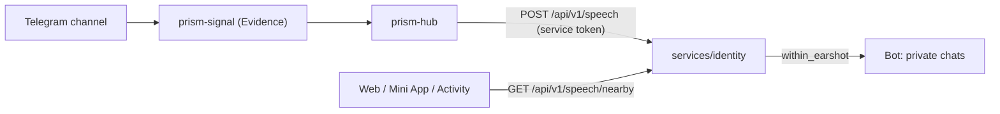

# Spoken lines

A permitted Bond can say a short text aloud, and the Bonds within earshot hear
it. Today the permitted Bonds are `0x0sky` and `0xfrSb`, and every line comes
from a Telegram channel through Prism. This document is presentation and
delivery architecture only; it never defines Bond, Relationship, BondChain, or
any other protocol truth.

## What it is not

- **Not an Interaction.** A line has no counterpart action, no reciprocity, and
  no consent. It completes no BondChain entry and creates no Relationship.
- **Not presence evidence.** A line carries no coordinate and no response
  carries one. Hearing a line does tell a listener that the speaker is within
  earshot, and that is the whole disclosure: it exists only because the speaker
  is one of the few Bonds permitted to speak, and it is limited by the earshot
  radius. Widening either is a decision, not a default.
- **Not on this device.** A line is never stored by the client and never
  reaches analytics or `4x-errors`.

The shape and the notion of "near" are Core's: `SpokenLine`, `distance_meters`,
and `within_earshot` in `nilx-one/core` (`docs/spoken-line.md`). The service
does not implement its own distance.

## Flow



Dependency direction follows the Prism ecosystem: `prism-signal` never calls a
client, the hub owns which channel speaks as which Bond, and this service only
accepts, gates, stores, and redistributes. The hub side of this arrow is not
built yet; the ingest contract below is what it will call.

## Ingest

`POST /api/v1/speech`, `Authorization: Bearer <SPEECH_INGEST_TOKEN>`:

```json
{
  "source": "telegram.channel:name",
  "external_id": "name/123",
  "speaker": "0x0sky",
  "text": "Hello.",
  "spoken_at": 1800000000
}
```

- `(source, external_id)` is the deduplication key. The line id is
  `line_` + `sha256(source "\n" external_id)`; a redelivery is the same line.
- `text` must already be a valid Core `SpokenText`: 1–280 scalars, NFC, no
  control characters except line feed, no surrounding whitespace. The service
  refuses longer text with `invalid_text` rather than cutting it; shortening is
  the producer's decision.
- `speaker` must hold a `bond_speakers` row. Unknown and not-permitted Bonds
  both answer `403 speaker_not_permitted`.
- `spoken_at` may not be more than 60 s ahead. A line older than ten minutes
  (`SPEECH_TTL_SECONDS`) answers `200 expired` and is neither stored nor copied,
  so a producer replaying a backlog can never be answered with a retry loop.
- New line: `201 recorded` with `relayed_to`. Same line again: `200 duplicate`.

## Who hears it

| Where             | Who                                                                                                                       |
| ----------------- | ------------------------------------------------------------------------------------------------------------------------- |
| Web / Mini App    | The speaker, always. Any other signed-in Bond whose current location is within earshot of the speaker's current location. |
| Telegram bot copy | Telegram-bound Bonds within earshot, nearest first, at most 100, never the speaker. Plain text `0x0sky: …`.               |

A `live` location older than 30 minutes no longer places its Bond anywhere; a
declared `manual` point does not age. A Bond with no current location hears no
one but themself. The earshot radius is `SPEECH_EARSHOT_METERS` (default 500,
Core allows 1–5000).

The client shows a heard line in the existing notice stack, under the speaker's
`pub_dress`. It polls while the page is visible, ignores anything older than
30 seconds when first seen, and lets a line fade after 20 seconds. The map
draws no body for any Bond but the one at the wheel, so there is no avatar to
anchor a bubble to.

## Who may speak

`bond_speakers` holds the permitted Bonds. Like `bond_roles`, it is created and
seeded once: `0x0sky` and `0xfrSb` are carried over when the table is created,
and after that a name grants nothing by itself. If `0xfrSb` has not registered
by then, add it once it has:

```sql
INSERT OR IGNORE INTO bond_speakers (pub_dress)
SELECT pub_dress FROM identities WHERE identity_kind = 'human' AND pub_dress = '0xfrSb';
```

There is no API that assigns the capability.

## Off by default

Without `SPEECH_INGEST_TOKEN` the routes are not mounted, and a client that
asks receives 404 and stays silent.

---

© 2026 aiaiaiai · aiaiaiai.org
